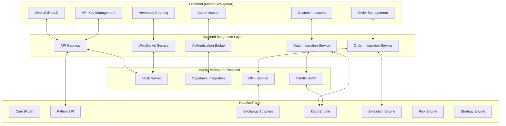
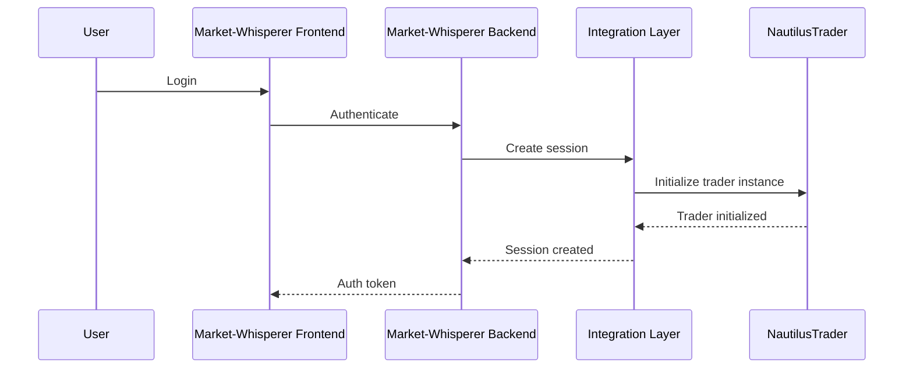
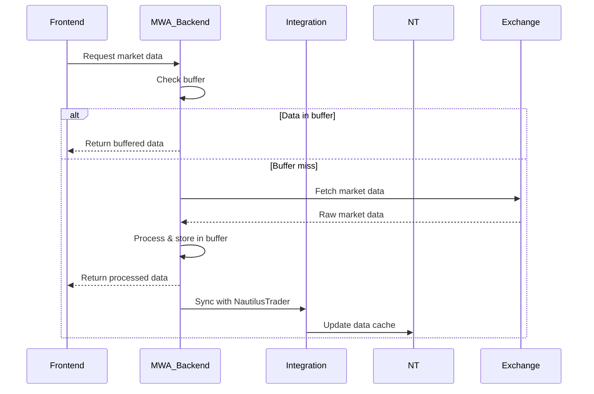
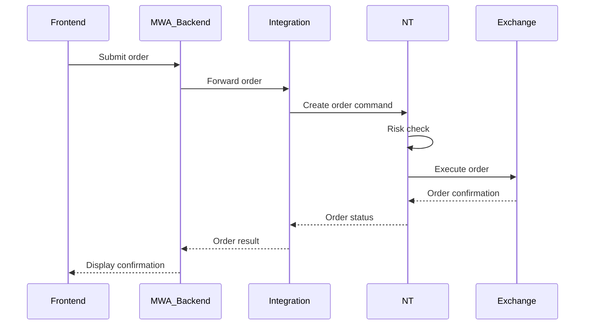

# Market Whisperer Integration Architecture Specification

## Overview

This document provides the comprehensive integration architecture specification for connecting Market Whisperer frontend components with Nautilus Trader backend systems. The integration enables seamless authentication, data synchronization, order execution, and real-time communication between the systems.

## Table of Contents

1. [Integration Architecture](#1-integration-architecture)
2. [Data Flow Patterns](#2-data-flow-patterns)
3. [Authentication Bridge](#3-authentication-bridge)
4. [Data Integration Service](#4-data-integration-service)
5. [Order Integration Service](#5-order-integration-service)
6. [WebSocket Integration Service](#6-websocket-integration-service)
7. [Configuration Management](#7-configuration-management)
8. [Testing Specifications](#8-testing-specifications)

## 1. Integration Architecture

### High-Level Architecture



### Component Responsibilities

#### Frontend Layer
- **Web UI**: React-based interface with shadcn-ui and Tailwind CSS
- **Authentication**: User login and session management
- **API Key Management**: Secure storage and management of exchange credentials
- **Advanced Charting**: Multi-timeframe charts with custom indicators
- **Order Management**: Trading interface for spot and margin orders

#### Integration Layer
- **API Gateway**: Central routing and request handling
- **Authentication Bridge**: Supabase auth integration with Nautilus
- **Data Integration Service**: Synchronizes market data between systems
- **Order Integration Service**: Routes orders through Nautilus execution engine
- **WebSocket Service**: Real-time data streaming and updates

#### Backend Systems
- **Market-Whisperer Backend**: Flask server with Supabase integration
- **Nautilus Trader**: High-performance trading engine and adapters

## 2. Data Flow Patterns

### Authentication Flow


### Market Data Flow


### Order Execution Flow


## 3. Authentication Bridge

### Purpose
Bridges Market Whisperer Supabase authentication with Nautilus Trader user management, creating isolated trader instances for each authenticated user.

### Implementation Location
**File**: `nautilus_trader/integrations/market_whisperer/auth_bridge.py`

### Key Features
- Supabase authentication integration
- User session management
- Nautilus trader instance mapping
- JWT token validation
- User permission management

### Class Definition
```python
class AuthenticationBridge:
    """
    Bridges Market Whisperer Supabase auth with Nautilus Trader.
    """

    def __init__(self, supabase_url: str, supabase_key: str):
        self.supabase = create_client(supabase_url, supabase_key)
        self.user_traders: Dict[str, NautilusKernel] = {}
        self.active_sessions: Dict[str, Dict] = {}

    async def authenticate(self, email: str, password: str) -> Dict | None:
        """Authenticate user and create Nautilus trader instance."""
        # Implementation details provided in NautilusTrader_MarketWhisperer_Integration_Plan.md

    async def validate_token(self, token: str) -> Dict | None:
        """Validate JWT token and return user info."""
        # Implementation details provided in NautilusTrader_MarketWhisperer_Integration_Plan.md

    async def get_trader(self, user_id: str) -> NautilusKernel | None:
        """Get Nautilus trader instance for user."""
        # Implementation details provided in NautilusTrader_MarketWhisperer_Integration_Plan.md
```

### Validation Requirements
- [ ] Test Supabase authentication flow
- [ ] Verify JWT token validation
- [ ] Test trader instance creation
- [ ] Validate session management

### Acceptance Criteria
- Authentication completes within 2 seconds
- JWT tokens are validated correctly
- Trader instances are created successfully
- Session management prevents unauthorized access

## 4. Data Integration Service

### Purpose
Integrates Market Whisperer's candle buffer with Nautilus Trader's data engine, ensuring data consistency and synchronization between systems.

### Implementation Location
**File**: `nautilus_trader/integrations/market_whisperer/data_service.py`

### Key Features
- Data format conversion between systems
- Candle buffer synchronization
- Real-time data streaming
- Data validation and integrity checks
- Performance monitoring and caching

### Class Definition
```python
class DataIntegrationService:
    """
    Integrates Market Whisperer data with Nautilus Trader.
    """

    def __init__(self, rolling_data_managers: Dict[str, OKXRollingDataManager]):
        self.rolling_data_managers = rolling_data_managers
        self.data_cache: Dict[str, Any] = {}
        self.last_update: Dict[str, float] = {}

    async def get_market_data(
        self,
        symbol: str,
        timeframe: str,
        limit: int = 1000
    ) -> Dict:
        """Get market data for symbol and timeframe."""
        # Implementation details provided in NautilusTrader_MarketWhisperer_Integration_Plan.md

    def convert_nautilus_to_mw_format(self, bars: List[Bar]) -> Dict:
        """Convert Nautilus bars to Market Whisperer format."""
        # Implementation details provided in NautilusTrader_MarketWhisperer_Integration_Plan.md

    async def sync_data_with_nautilus(self, symbol: str, timeframe: str):
        """Sync data between systems."""
        # Implementation details provided in NautilusTrader_MarketWhisperer_Integration_Plan.md
```

### Data Conversion Requirements
- [ ] Nautilus Bar → Market Whisperer Candle format
- [ ] Nautilus Trade → Market Whisperer Trade format
- [ ] Nautilus OrderBook → Market Whisperer OrderBook format
- [ ] Nautilus Position → Market Whisperer Position format
- [ ] Nautilus Order → Market Whisperer Order format

### Validation Requirements
- [ ] Test data format conversions
- [ ] Verify data caching effectiveness
- [ ] Test data validation rules
- [ ] Validate performance monitoring

### Acceptance Criteria
- Data conversions are 100% accurate
- Caching reduces response time by >80%
- Data validation prevents corrupted data
- Performance monitoring provides useful metrics

## 5. Order Integration Service

### Purpose
Integrates Market Whisperer's order management with Nautilus Trader's execution engine, routing orders through proper risk management and execution workflows.

### Implementation Location
**File**: `nautilus_trader/integrations/market_whisperer/order_service.py`

### Key Features
- Order routing through Nautilus execution engine
- Risk management integration
- Order status tracking and updates
- Multi-exchange support
- Error handling and recovery

### Class Definition
```python
class OrderIntegrationService:
    """
    Integrates Market Whisperer's order management with NautilusTrader's execution engine.
    """

    def __init__(self, auth_bridge: AuthenticationBridge, nautilus_exec_client_factory):
        self.auth_bridge = auth_bridge
        self.exec_client_factory = nautilus_exec_client_factory
        self.exec_clients = {}  # Maps exchange names to execution clients

    async def initialize(self, user_id, exchange, api_key, secret_key, passphrase=None):
        """Initialize execution client for a user and exchange."""
        # Implementation details provided in NautilusTrader_MarketWhisperer_Integration_Plan.md

    async def submit_order(self, user_id, exchange, order_params):
        """Submit an order through NautilusTrader."""
        # Implementation details provided in NautilusTrader_MarketWhisperer_Integration_Plan.md
```

### Validation Requirements
- [ ] Test order submission flow
- [ ] Verify risk management integration
- [ ] Test order status updates
- [ ] Validate error handling

### Acceptance Criteria
- Orders are routed correctly through Nautilus
- Risk management rules are enforced
- Order status updates are real-time
- Error handling provides meaningful feedback

## 6. WebSocket Integration Service

### Purpose
Provides real-time data streaming between Nautilus Trader and Market Whisperer frontend, enabling live updates for charts, orders, and positions.

### Implementation Location
**File**: `nautilus_trader/integrations/market_whisperer/websocket_service.py`

### Key Features
- Real-time data streaming
- Client connection management
- Message routing and filtering
- Error handling and reconnection
- Performance monitoring

### Class Definition
```python
class WebSocketIntegrationService:
    """
    Provides real-time data streaming between Nautilus and frontend.
    """

    def __init__(self, auth_bridge: AuthenticationBridge, port: int = 8081):
        self.auth_bridge = auth_bridge
        self.port = port
        self.connections: Dict[str, websockets.WebSocketServerProtocol] = {}

    async def register_connection(self, user_id: str, websocket):
        """Register WebSocket connection for user."""
        # Implementation details provided in NautilusTrader_MarketWhisperer_Integration_Plan.md

    async def broadcast_market_data(self, symbol: str, data: Dict):
        """Broadcast market data to connected clients."""
        # Implementation details provided in NautilusTrader_MarketWhisperer_Integration_Plan.md

    async def handle_client_message(self, user_id: str, message: Dict):
        """Handle messages from client."""
        # Implementation details provided in NautilusTrader_MarketWhisperer_Integration_Plan.md
```

### Message Types to Support
- [ ] `subscribe_bars` - Subscribe to bar data
- [ ] `unsubscribe_bars` - Unsubscribe from bar data
- [ ] `subscribe_trades` - Subscribe to trade data
- [ ] `subscribe_orderbook` - Subscribe to order book data
- [ ] `order_update` - Order status updates
- [ ] `position_update` - Position updates
- [ ] `balance_update` - Balance updates

### Validation Requirements
- [ ] Test WebSocket connections
- [ ] Verify real-time data streaming
- [ ] Test client disconnection handling
- [ ] Validate message routing

### Acceptance Criteria
- WebSocket connections establish within 1 second
- Real-time data has <100ms latency
- Client disconnections are handled gracefully
- Message routing is accurate and reliable

## 7. Configuration Management

### Integration Configuration
```python
@dataclass(frozen=True)
class MarketWhispererIntegrationConfig:
    """Configuration for Market Whisperer integration."""

    # Service settings
    api_gateway_port: int = 8080
    websocket_port: int = 8081
    host: str = "localhost"

    # Authentication
    supabase_url: str
    supabase_service_role_key: str
    jwt_secret: str
    session_timeout_minutes: int = 60

    # Security
    enable_cors: bool = True
    allowed_origins: List[str] = field(default_factory=lambda: ["http://localhost:3000"])
    enable_rate_limiting: bool = True
    max_requests_per_minute: int = 100

    # Features
    enable_real_time_data: bool = True
    enable_order_execution: bool = True
    enable_position_management: bool = True

    # Performance
    max_concurrent_connections: int = 100
    message_queue_size: int = 1000
    heartbeat_interval_seconds: int = 30
```

### Validation Requirements
- [ ] Test configuration validation
- [ ] Verify security settings
- [ ] Test environment loading
- [ ] Validate performance settings

### Acceptance Criteria
- Configuration validation is comprehensive
- Security settings are enforced
- Environment variables load correctly
- Performance settings are optimized

## 8. Testing Specifications

### Integration Testing Requirements
- [ ] Test complete authentication flow
- [ ] Verify data synchronization between systems
- [ ] Test order execution end-to-end
- [ ] Validate real-time data streaming
- [ ] Test error recovery scenarios

### Performance Testing Requirements
- [ ] WebSocket connection load testing
- [ ] Data synchronization latency testing
- [ ] Order execution performance testing
- [ ] Memory usage under sustained load
- [ ] Concurrent user testing

### Security Testing Requirements
- [ ] Authentication security testing
- [ ] JWT token validation testing
- [ ] API endpoint security testing
- [ ] Data access control testing
- [ ] Session management security testing

This specification provides the foundation for implementing Phase 3 and Phase 4 of the master implementation plan.
